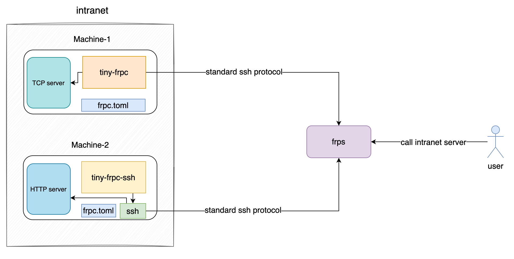

# tiny-frpc

# 简介

frp 在 >= v0.53.0 版本已经支持 ssh tunnel 模式 [ssh tunnel gateway](https://github.com/fatedier/frp?tab=readme-ov-file#ssh-tunnel-gateway)。 用户可以通过标准的 ssh 协议来跟 frps 进行通信，完成反向代理。该模式可以不依赖于 frpc 二进制。

很多用户需要在一些低配计算机或嵌入式设备里使用反向代理，这些机器内存和存储空间有限，可能无法正常使用原版的 frpc。本项目旨在提供最简版本的反向代理，只通过 ssh 协议与 frps 完成反向代理。

我们提供了2种二进制程序，native ssh 的版本(tiny-frpc-ssh)和 standalone 版本(tiny-frpc)。2种程序都是解析 frpc toml 文件(conf/frpc_full_example.toml)，与 frps 通信完成反向代理。

* native ssh 版本需要你本机已经有 ssh 程序，否则无法使用。 该二进制文件较小。

* standalone 版本不依赖本机的 ssh 程序。该二进制文件较大。


# 使用

## 1. 下载 tiny-frpc
用户自己决定是用 native ssh 版本还是 standalone 版本。请移步到本项目的 [releases](https://github.com/gofrp/tiny-frpc/releases) 下载。


## 2. 准备 frpc toml 文件
注意：本项目只支持 toml 文件格式。
压缩包解压之后，里面有最简使用配置，完整配置参考本项目 conf/frpc_full_example.toml

举个例子：

frps 的最简配置：
```
# frps.toml

bindPort = 7000

vhostHTTPPort = 80

sshTunnelGateway.bindPort = 2200
```

tiny-frpc 的配置：
```
# frpc.toml

serverAddr = "x.x.x.x"

# frps ssh tunnel gateway port
serverPort = 2200

[[proxies]]
name = "test-tcp-server"
type = "tcp"
localIP = "127.0.0.1"
localPort = 5000
remotePort = 6000

[[proxies]]
name = "test-http-web"
type = "http"
localIP = "127.0.0.1"
localPort = 7080
customDomains = ["test-tiny-frpc.frps.com"]
locations = ["/", "/pic"]
```

## 3. 运行
> ./tiny-frpc -c frpc.toml

or

> ./tiny-frpc-ssh -c frpc.toml


TCP 服务：

> nc -zv x.x.x.x 6000

or

> telnet x.x.x.x 6000

可以测试内网端口是否已经成功代理到公网。如果通了，可以在公网访问 TCP 服务了。

HTTP 服务：

假设 test-tiny-frpc.frps.com 域名解析到 frps 所在的机器，则可以通过

> curl -v 'http://test-tiny-frpc.frps.com/'

访问到内网的 HTTP 服务。


# 原理



# 说明

**当前是预览版本，不保证兼容性，目前仅供测试使用，不要用于生产环境!!!**
